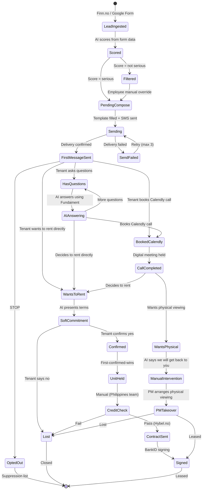
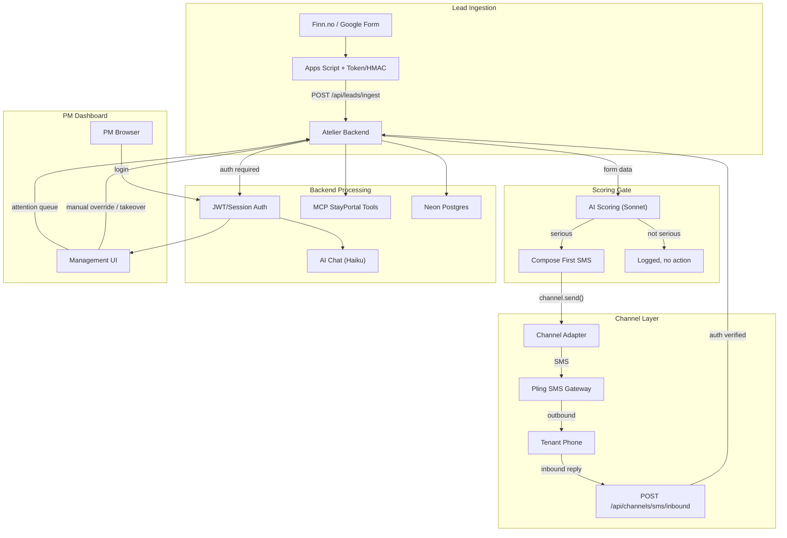
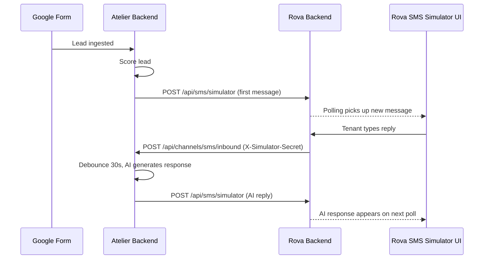

# PRD: Atelier V2 — Outbound Tenant Engagement Platform

**Version:** 2.4
**Date:** April 4, 2026
**Author:** Stay Management AS
**Status:** Approved
**Changelog (v2.4):** Adds §1.2 documenting the **legacy Vite dashboard UI V2 pack** (April 2026): design system (`DESIGN.md`), product/UI spec (`docs/atelier-ui-v2-plan.md` in `akijain2000/atelier`), inbound SMS hardening, DB-aware health checks, and PM dashboard UX (session toast, confirm dialogs, mobile shell, queue/lead/conversation improvements). See `atelier/CHANGELOG.md` in that repo for file-level release notes.
**Changelog (v2.3):** Adds §1.1 code repositories and hosting (canonical Next.js Atelier on GitHub/Vercel, legacy Atelier repo, Rova role).
**Changelog (v2.2):** Documents unified lead-scoring rubric (preliminary + conversation), behavioral signals, four weighted sub-scores; explicitly excludes AI scoring of stay duration and budget (credit check / lease norms).
**Supersedes:** PRD v2.1 (April 2, 2026); PRD v1.0 (March 30, 2026) — web chat sandbox

---

## 1. Product Vision

Atelier is an outbound tenant engagement platform for property managers. Leads enter via Finn.no / Google Form, are scored by AI, and serious leads receive a proactive SMS with a video tour link. An AI concierge (Oline) handles the conversation via SMS — answering questions, presenting lease terms, and collecting soft commitments — while a PM dashboard gives property managers real-time visibility and manual override capability.

The product bridges the gap between lead capture (Finn.no form) and lease signing (Hybel.no + BankID), automating the middle of the funnel where most leads are lost to slow response times.

**Name origin:** "Atelier" — a workshop where craft happens. The property manager's workshop for tenant engagement.

**V1 vs V2:** V1 was a web chat sandbox where someone typed as the tenant. V2 is a production system where AI initiates contact via SMS and the PM observes/intervenes through a dashboard.

### 1.1 Code repositories and hosting

Canonical URLs below are from [GitHub](https://github.com) repository metadata as of April 2026.

| Codebase | GitHub | Default branch | Deploy / homepage | Role |
|----------|--------|----------------|-------------------|------|
| **Atelier (Next.js — active)** | [anubhavb11/Atelier](https://github.com/anubhavb11/Atelier) | `main` | [Vercel app](https://atelier-three-ashen.vercel.app) (repository homepage field) | PM dashboard, API routes, lead ingest, scoring, SMS/simulator channel layer — **primary repo for new work** |
| **Atelier (legacy sandbox)** | [akijain2000/atelier](https://github.com/akijain2000/atelier) | `main` | Historical Render path (see work log) | Vite + Express three-panel chat prototype; GitHub description: *Tenant chat & lead scoring platform — AI concierge + real-time scoring for property managers* |
| **Rova (`rova-chatbot`)** | *No public repo found* under the same GitHub users checked | — | **Render** (per engineering runbooks) | Internal workspace: React 19 + Vite 7 + Express 4 + Postgres; prompt tooling and **SMS Simulator** that POSTs to Atelier inbound with `X-Simulator-Secret`. Add the team’s canonical clone URL here when Rova is published: `https://github.com/<org>/<repo>` |

**Clone (active Atelier):** `git clone https://github.com/anubhavb11/Atelier.git`

**Operational note:** Ingest webhooks (Google Apps Script), Pling SMS, or alternate hosts (e.g. Render/Railway) are configured per environment; the GitHub **homepage** field points at the Vercel UI for the Next.js app.

### 1.2 Legacy Vite dashboard — UI V2 pack (April 2026)

The [akijain2000/atelier](https://github.com/akijain2000/atelier) **legacy** codebase (Vite + Express + Postgres) received a coordinated product/design/engineering pass so the PM dashboard, ops surface, and documentation stay usable for Render-based testing and **strangler** handoff to the Next.js canonical app.

| Area | What shipped | Where to read it |
|------|----------------|------------------|
| **Design system** | App UI tokens (color, type, spacing), layout breakpoints, motion, focus/a11y rules; mandatory pre-read for UI work | `DESIGN.md` (repository root of legacy repo) |
| **UI V2 specification** | Every dashboard screen, empty/error states, responsive rules, IA, primary user journey, and **plan-design-review** outcomes (e.g. queue as Form / Conversation columns, dual score display, **Score Now**, destructive **ConfirmDialog**, session-expired toast before login redirect, heading font rule) | `docs/atelier-ui-v2-plan.md` |
| **Inbound SMS security** | Rejects inbound webhooks that are not authenticated when neither Pling nor simulator credentials are configured to accept the request | `server.js` inbound path |
| **Health / DB** | `GET /api/health` runs `SELECT 1`; JSON includes `db: connected` or `db: error`; responds **503** when the database is down so load balancers and deploy hooks fail loudly | `server.js` |
| **Dashboard UX** | `ConfirmDialog` + `Toast`; custom event for session expiry in `Dashboard.jsx`; hamburger + overlay sidebar under 768px; Attention Queue columns + stale / updated-ago; Filtered Leads row navigation with confirm; ConversationView empty thread, last-updated, composer hint, Score Now → `POST .../score`; `:focus-visible` and login spacing per `DESIGN.md` | `src/components/*`, `src/pages/*`, `src/styles.css` |

**Canonical product direction:** net-new features and the long-term roadmap still land in [anubhavb11/Atelier](https://github.com/anubhavb11/Atelier) (Next.js). The legacy pack exists so operators, QA (e.g. gstack browse / design-review / qa-only against localhost or Render), and engineers porting behavior have a **single spec** (`docs/atelier-ui-v2-plan.md`) aligned to this PRD.

---

## 2. Lead-to-Lease Pipeline

The complete flow from lead capture to signed lease:



**Key design decisions:**

- AI scores leads BEFORE sending SMS. Only "serious" leads are contacted. This is a gate, not just analytics. Filtered leads are visible to employees who can manually push them into the pipeline.
- First SMS is a templated message (not free-form AI), pushing the video tour link.
- "Fundament" is the knowledge base (MCP tools + prompts + lease data) the AI uses to answer questions and present terms.
- Unit allocation is first-confirmed-wins. Once a tenant confirms, the unit is held.
- Credit check, Hybel.no contract, and BankID signing are manual steps handled by the Philippines team. Atelier triggers the handoff but does not own these steps.
- **Calendly is a primary CTA, not a fallback.** The first SMS includes both the video tour link AND the Calendly booking link. AI naturally weaves Calendly into the conversation when it fits — not in every message, but periodically and warmly. Booking a call is the desired conversion path — most tenants should either book a Calendly call or rent directly after the video.
- **Physical viewing is the manual escalation.** If after the Calendly call the tenant still wants a physical viewing, AI responds "We've raised this, we'll get back to you." Shows as "requires manual intervention" in dashboard. PM arranges viewing directly.

---

## 3. User Personas

### Property Manager (Primary)

- Manages 10-50 rental listings across Bergen
- Receives 5-20 new tenant inquiries per day via Finn.no
- Needs to quickly identify high-quality leads vs. time-wasters
- Wants the AI to handle outreach, Q&A, and soft commitments via SMS
- Intervenes manually for physical viewings, complex situations, or final lease steps
- Uses the PM dashboard to monitor AI conversations, override when needed

### Philippines Operations Team

- Handles credit checks (Experian/Bisnode)
- Prepares and sends Hybel.no contracts
- Monitors BankID signing completion
- Receives handoffs from Atelier when a tenant confirms (flow_state = `confirmed`)

### Tenant (End User)

- Finds a listing on Finn.no, fills out the interest form
- Receives an SMS from Atelier with a video tour link
- Chats with AI via SMS to ask questions, watch the video, decide to rent or request a physical viewing
- Does NOT interact with the Atelier UI directly — all interaction is via SMS

### Stay Management Admin

- Oversees all properties and conversations across the team
- Reviews filtered (non-serious) leads for false negatives
- Configures scoring thresholds, templates, and listing data
- Tracks conversion metrics and AI performance

---

## 4. User Interfaces

### 4.1 PM Dashboard (Web Application)

Auth-protected web application for property managers. Replaces the V1 three-panel chat UI with a lead-centric management view.

**Primary view: Attention Queue**

Not a flat conversation list. Prioritized by urgency:

- "Needs action" at top: failed sends, awaiting reply > 24h, hot scores, SLA breach, `manual_intervention` items
- Grouped by listing
- Each row: tenant name, phone, score badge (preliminary + conversation), flow state, last message preview, time since last activity
- Click opens conversation thread

**Filtered Leads view**

Dedicated section for leads that didn't pass the scoring gate:

- Shows all leads with `flow_state = 'filtered'`
- Sorted by preliminary score (highest first)
- Grouped by month with clear visual demarcation (e.g., "April 2026", "March 2026")
- Each row: tenant name, phone, age, occupation, move-in date, preliminary score, intro snippet
- Manual override button: employee clicks to push lead into `pending_compose` (triggers first SMS)
- All overrides logged in audit table with employee identity

**Conversation Thread View**

- **TenantProfileCard** pinned above thread: Google Form data (name, age, status, move-in date, intro)
- **Listing summary** card below profile
- **Message thread**: tenant messages (left-aligned), AI messages (right-aligned), PM messages (right-aligned with highlighted border)
- **Per-message delivery badge**: queued / sent / delivered / failed with retry action
- **Channel indicator** on each message (SMS icon)

**PMComposer**

- **Channel toggle**: SMS send vs. internal note (separate streams, prevents accidental sends)
- **Segment preview**: character count, SMS segment count, GSM-7 vs UCS-2 indicator
- **Human takeover banner**: "You're replying as PM. AI paused." with toggle to re-enable AI
- **AI/Manual toggle** per conversation
- **Score Now** button to trigger re-scoring

### 4.2 Tenant Interface

There is no tenant-facing UI. All tenant interaction happens via SMS on their phone.

- Outbound: AI sends templated first message, then contextual responses
- Inbound: Tenant replies via standard SMS
- Opt-out: Tenant sends "STOP" to unsubscribe

---

## 5. Feature Specification

### 5.1 Lead Ingestion

Leads enter via Google Form (linked from Finn.no listing). A Google Apps Script webhook fires on form submission.

**Flow:**
1. Tenant fills out Google Form (name, age, email, phone, move-in date, occupation/status, intro text, gender (optional), SMS consent checkbox)
2. Apps Script fires `onFormSubmit`, POSTs to Atelier with `X-Webhook-Token` header (HMAC signature as fallback)
3. Atelier validates token/signature, normalizes phone to E.164, dedupes on phone+listing
4. Creates conversation row with tenant profile in Postgres
5. Triggers scoring gate

**Consent:** Form must include a required checkbox: "Jeg godtar at Stay Management kontakter meg via SMS." No SMS without consent.

### 5.2 Scoring Gate

AI scores every lead immediately from form data. This is a binary gate: serious leads get an SMS, non-serious leads are filtered.

**Input:** name, age, occupation/status, move-in date, intro text, gender (optional)
**Model:** Anthropic Claude Sonnet (scoring model)
**Prompt:** Unified `LeadScoring.md` in **MODE: PRELIMINARY** — same rubric family as conversation scoring so scores stay comparable across stages.
**Output:** preliminary score (0–100), conversion likelihood tier, full `sub_scores` JSON (see §5.5), `recommended_action`, `summary`, red flags
**Threshold:** configurable via `LEAD_SCORE_THRESHOLD` env var (default 40)

- Above threshold: `flow_state = 'pending_compose'`, proceeds to first message
- Below threshold: `flow_state = 'filtered'`, logged in audit table
- Preliminary rows in `scores` use `score_type = 'preliminary'` with `sub_scores` persisted (dashboard shows breakdown from intake even before chat)

**Out of scope for AI scoring:** **Stay duration** and **budget / financial fit** are not sub-scores. Typical stays align with standard lease cycles; **budget and solvency** are validated in the credit-check step (operations), not inferred from chat.

**Filtered leads management:** All filtered leads are visible in a dedicated "Filtered Leads" section of the PM dashboard. Leads are sorted by preliminary score (highest first) and grouped by month with clear visual demarcation (e.g., "April 2026", "March 2026"). An employee can review any filtered lead and manually push it into the pipeline (`pending_compose`), which triggers the first SMS. All overrides are logged in the audit table.

### 5.3 Templated First Message

Only sent to leads that pass the scoring gate. Uses approved templates with AI-filled slots.

**Template (Norwegian):**
> Hei {{name}}! Takk for at du er interessert i {{property}}. Sjekk videoomvisningen: {{video_url}} Du kan også booke en samtale med oss: {{calendly_url}} Vi er tilgjengelige det meste av uken!

**Two primary CTAs in every first message:** (1) video tour link, (2) Calendly booking link.

- AI fills slots from tenant profile + listing data + Calendly link
- Template is ~2 SMS segments (~250-300 chars) since it includes two links — acceptable for first touch
- Language detection from form intro text, default Norwegian
- No free-form AI claims about price/availability without tool-grounded facts

### 5.4 AI Chat (SMS)

After the first message, the AI concierge handles ongoing conversation via SMS.

**Model:** Anthropic Claude Haiku (3.75x cheaper than Sonnet for chat)
**Knowledge base (Fundament):** MCP StayPortal tools + system prompt + lease key facts + listing snapshot

**Capabilities per flow state:**

- **has_questions**: Answer using Fundament. Naturally weave in video link and Calendly when relevant — not in every message, but periodically when it fits the conversation (e.g., after answering a couple of questions, or when tenant seems interested but uncertain). Keep it friendly, not pushy.
- **booked_calendly**: Tenant booked a Calendly call. AI acknowledges and expresses looking forward to speaking.
- **call_completed**: After digital meeting. May transition to `wants_to_rent` (decides to rent) or `wants_physical` (needs physical viewing).
- **wants_to_rent**: Present lease terms as a concise summary (rent, deposit, move-in date, duration, pet policy, parking). Ask for explicit confirmation.
- **soft_commitment**: Await yes/no. On yes: transition to `confirmed`, alert PM, explain next steps (credit check, contract). On no: transition to `lost`.
- **wants_physical**: Tenant asks for physical viewing (in chat or after Calendly call). AI responds "We've raised this to the team, we'll get back to you." Transition to `manual_intervention`. Dashboard shows "requires manual intervention."
- **manual_intervention / pm_takeover**: AI pauses. PM handles directly.

**Natural conversation flow (debounce-based):**

Unlike a rigid chatbot that responds to each message individually, Atelier mimics real human texting behavior:

1. When a tenant sends a message, a 30-second debounce timer starts (configurable via `SMS_REPLY_DELAY_S`)
2. If more messages arrive during the window, the timer resets — the AI waits for the tenant to finish typing
3. When the timer fires, the AI sees ALL unresponded messages and generates ONE response addressing everything
4. Hard cap: if the first unresponded message is >2 minutes old (`SMS_REPLY_MAX_WAIT_S`), respond immediately regardless
5. If a message arrives while the AI is mid-generation: finish the current response, send it, then start a shorter 10-second debounce for the new message

This produces natural conversations:
> Tenant: "Is it available?" → Tenant: "Also pets?" → Tenant: "What floor?" → [30s silence] → AI: "Hi! Yes, 3rd floor, pets allowed..."

**SMS constraints:**
- Default max: 320 chars per response (2 SMS segments)
- Two-layer enforcement: (1) `max_tokens` parameter on Anthropic API call (~80 tokens for SMS), (2) sentence-boundary truncation as safety net with warning log
- Post-processor strips markdown, enforces hard max, handles segment-aware splitting
- GSM 03.38 charset: Norwegian characters (å, ø, æ) are in the basic set

### 5.5 Confidence Scoring (Ongoing)

Separate from the scoring gate (which is form-data-only at ingest). Ongoing scoring evaluates profile + conversation + behavioral metadata using the **same** `LeadScoring.md` in **MODE: CONVERSATION**.

**Input to the model (conversation pass):**
- **TENANT PROFILE** — intake form fields (so profile fit and first-message quality do not depend on the tenant repeating themselves in SMS)
- **BEHAVIORAL SIGNALS** — computed server-side (e.g. video tour sent/acknowledged, Calendly shared/booked, average tenant reply latency, current `flow_state`, message counts)
- **CONVERSATION TRANSCRIPT** — labeled speakers: `Tenant`, `Oline` (AI), `Property Manager` (dashboard sends). PM lines must not count as tenant engagement or intent.

**Sub-scores (1–5 each, weighted into 0–100 with red-flag penalty):**

| Sub-score | Weight | Notes |
|-----------|--------|--------|
| Conversion intent | 30% | Explicit rent/sign language, state signals |
| Engagement quality | 30% | SMS-realistic; uses behavioral signals |
| First message quality | 20% | Form intro in preliminary; first tenant SMS + form context in conversation |
| Tenant profile fit | 20% | Demographics / student–professional fit |

**Preliminary mode:** Engagement and conversion intent default to neutral (3/5) with reason *No conversation yet* until chat exists.

**Triggers:**
- Milestone-based auto re-score after SMS auto-reply pipeline (watermark uses only `score_type = 'conversation'` rows)
- On PM request ("Score Now" / "Re-score" in dashboard)
- Optional hooks after key state transitions (as implemented in backend)

**Model:** Anthropic Claude Sonnet (may test Haiku A/B in Phase 3)
**Rubric adapted for SMS:** shorter threads are normal; quality of signals beats raw message count

**Dashboard shows both scores:** preliminary (intake) and latest conversation score, each with sub-score breakdown and source label (*Based on intake form* vs *Based on conversation*).

### 5.6 Calendly as Primary CTA

Calendly booking is a **primary conversion path**, not a fallback. The first SMS includes the Calendly link alongside the video tour, and the AI proactively pushes booking throughout every conversation.

**Calendly call flow:**
- First SMS includes Calendly link: "You can also book a call with us — we're available most of the week!"
- AI reminds about Calendly in every Q&A response
- Tenant books a call → `flow_state = 'booked_calendly'`
- Call happens → `flow_state = 'call_completed'`
- After call: tenant either decides to rent (→ `wants_to_rent`) or requests physical viewing (→ `wants_physical`)

**Physical viewing (manual intervention):**
- Only triggered if tenant specifically asks for a physical viewing (in chat or after the Calendly call)
- AI responds: "We've raised this to the team, we'll get back to you."
- `flow_state = 'manual_intervention'`
- Shows as "requires manual intervention" in PM dashboard attention queue
- PM arranges the physical viewing directly

### 5.7 PM Takeover

PM can take over any conversation at any point, and is automatically alerted for certain states.

**Triggers for automatic PM alert:**
- Tenant confirms (`confirmed` state)
- Tenant needs physical viewing (`manual_intervention` state)
- Score drops below threshold during conversation
- Delivery failures after retries

**During takeover:**
- AI is paused for that conversation
- PM messages are sent via the same SMS channel
- Takeover banner visible in dashboard
- PM can re-enable AI at any time

### 5.7 Opt-Out Handling

- STOP keyword detection on inbound SMS
- Immediate suppression: no further messages sent
- `flow_state = 'opted_out'`
- Suppression list checked before every outbound send
- Logged in audit table

---

## 6. Data Model

### 6.1 Conversations

```
conversations
├── id                  UUID (primary key)
├── tenant_name         TEXT
├── phone               TEXT NOT NULL (E.164 normalized)
├── email               TEXT
├── age                 INTEGER
├── move_in_date        TEXT
├── tenant_status       TEXT (occupation/student status)
├── intro               TEXT (form intro text)
├── gender              TEXT (optional, from form)
├── property            TEXT (e.g. "Nygårdsgaten 94")
├── unit_hint           TEXT (e.g. "3-roms, 4th floor")
├── listing_id          TEXT
├── source              TEXT DEFAULT 'google_form'
├── consent_sms         BOOLEAN DEFAULT false
├── channel             TEXT DEFAULT 'sms'
├── flow_state          ENUM (see below)
├── preliminary_score   INTEGER (0-100, from scoring gate)
├── listing_snapshot    JSONB (cached listing data at creation)
├── created_at          TIMESTAMPTZ
├── updated_at          TIMESTAMPTZ
├── message_count       INT
└── preview             TEXT (last message, truncated)
```

**Flow state enum:**

`lead_ingested` | `filtered` | `pending_compose` | `sending` | `first_message_sent` | `has_questions` | `booked_calendly` | `call_completed` | `wants_to_rent` | `soft_commitment` | `confirmed` | `unit_held` | `credit_check` | `contract_sent` | `signed` | `wants_physical` | `manual_intervention` | `pm_takeover` | `lost` | `opted_out`

**Unique index:** `CREATE UNIQUE INDEX idx_phone_listing ON conversations(phone, listing_id) WHERE flow_state NOT IN ('lost', 'signed', 'opted_out')`

### 6.2 Messages

```
messages
├── id                  UUID (primary key)
├── conversation_id     UUID (FK -> conversations)
├── role                ENUM: "tenant", "assistant", "pm"
├── content             TEXT
├── channel             TEXT (e.g. "sms")
├── delivery_status     ENUM: "queued", "sent", "delivered", "failed"
├── external_id         TEXT (Pling message ID, for idempotency)
├── timestamp           TIMESTAMPTZ
├── model               TEXT (e.g. "claude-haiku-4-5-20251001")
├── latency_ms          INT (for AI messages)
└── metadata            JSONB (usage tokens, segment count, etc.)
```

### 6.3 Scores

```
scores
├── id                      UUID (primary key)
├── conversation_id         UUID (FK -> conversations)
├── score_type              ENUM: "preliminary", "conversation"
├── scored_at               TIMESTAMPTZ
├── overall_score           INT (0-100)
├── conversion_likelihood   TEXT ("VERY HIGH", "HIGH", etc.)
├── sub_scores              JSONB (full sub-score breakdown)
├── red_flags               JSONB (array of flag strings)
├── recommended_action      TEXT
├── summary                 TEXT
└── message_count_at_scoring INT
```

### 6.4 Audit Log

```
audit_log
├── id              UUID (primary key)
├── actor           TEXT (PM email or "system")
├── action          TEXT (e.g. "lead_filtered", "pm_takeover", "manual_override")
├── conversation_id UUID (FK -> conversations, nullable)
├── details         JSONB
└── created_at      TIMESTAMPTZ
```

---

## 7. System Architecture



### Channel-Agnostic Design

SMS today, extensible to WhatsApp/email tomorrow:

```
lib/channels/
  index.js       -- channel registry, send(channelType, to, body)
  sms.js         -- Pling adapter: sendSMS(), parseInbound(), parseSimulatorInbound(), verifyAuth()
  simulator.js   -- Simulator adapter: sendSimulated() -> HTTP POST to Rova
  types.js       -- channel enum, message shape
```

`SMS_CHANNEL_MODE` env var (`pling` | `simulator`, default `simulator`) determines which adapter handles SMS sends. The simulator routes messages to Rova's virtual phone UI for testing. Zero code changes needed to switch to production Pling.

### SMS Simulator (Development/Testing)

A cross-service testing tool that routes Atelier's SMS output to a virtual phone UI in Rova, enabling full end-to-end testing without a real SMS provider:



**Key properties:**
- Cross-database: Atelier and Rova on separate DBs, HTTP-only communication (exactly like a real SMS provider)
- Transparent swap: simulator sits behind the same `channelSend()` interface
- Character enforcement: hard 320-char cap, sentence-boundary truncation, GSM character set validation
- Auto-reply with debounce: natural conversation pacing (30s wait, 2min hard cap)
- PM can pause auto-reply per conversation for manual intervention

---

## 8. API Endpoints

### Public (Webhook, signature-verified)

| Method | Endpoint | Auth | Description |
|--------|----------|------|-------------|
| POST | `/api/leads/ingest` | X-Webhook-Token (primary) / HMAC signature (fallback) | Google Sheets webhook for new leads |
| POST | `/api/channels/sms/inbound` | Pling basic auth OR X-Simulator-Secret | Pling/simulator inbound SMS webhook |

### Protected (PM Dashboard, JWT required)

| Method | Endpoint | Description |
|--------|----------|-------------|
| GET | `/api/conversations` | List conversations with filters (flow_state, listing, score range) |
| GET | `/api/conversations/:id` | Get conversation with messages, scores, and profile |
| POST | `/api/conversations/:id/messages` | PM sends a message (triggers takeover) |
| PATCH | `/api/conversations/:id/flow-state` | Manual flow state transition (e.g., override filtered lead) |
| POST | `/api/conversations/:id/score` | Trigger re-scoring |
| GET | `/api/conversations/:id/scores` | Score history |
| POST | `/api/conversations/:id/takeover` | PM takes over conversation (pauses AI) |
| POST | `/api/conversations/:id/release` | PM releases conversation (re-enables AI) |
| GET | `/api/leads/attention` | Attention queue (needs-action items) |

### System

| Method | Endpoint | Description |
|--------|----------|-------------|
| GET | `/api/health` | Health check |
| POST | `/api/auth/login` | PM login (email/password) |
| POST | `/api/auth/logout` | PM logout |
| POST | `/api/leads/sync` | Manual backup sync from Google Sheet |

---

## 9. Tech Stack

| Layer | Technology |
|-------|------------|
| Frontend | React 19 + Vite |
| Styling | CSS custom properties (dark theme), no framework |
| Backend | Node.js + Express |
| AI Chat | Anthropic Claude Haiku (`claude-haiku-4-5-20251001`) |
| AI Scoring | Anthropic Claude Sonnet (`claude-sonnet-4-20250514`) |
| Knowledge Base | MCP StayPortal tools + system prompts + listing snapshots |
| SMS Gateway | Pling (Front Information AS) — 0.39-0.55 NOK/message |
| SMS Simulator | Rova virtual phone UI (dev/testing, routes via HTTP to Rova backend) |
| Database | Neon PostgreSQL |
| Auth | JWT/session-based |
| Lead Intake | Google Forms + Apps Script webhook |
| Booking | Calendly (`https://calendly.com/leasing-stay/15min`) |
| Deployment | Railway (`atelier-production-b43e.up.railway.app`) |

---

## 10. SMS Provider: Pling

**Provider:** Pling (Front Information AS) — [login.pling.as](https://login.pling.as/pling/gateway)

- REST API: HTTP POST JSON with `serviceid`, `phoneno` (+47 format), `txt`
- Auth: service ID + username/password
- Pricing: 0.39-0.55 NOK/message (vs ~0.75 NOK via Twilio international)
- Delivery status callbacks + incoming SMS support
- GSM 03.38 charset: Norwegian characters (å, ø, æ) are in the basic set — no UCS-2 encoding penalty

**Environment variables:** `PLING_SERVICE_ID`, `PLING_USERNAME`, `PLING_PASSWORD`

---

## 11. External System Handoffs

Atelier owns the funnel from lead ingestion through soft commitment. After that, it hands off to external systems:

| Handoff Point | External System | Trigger |
|---------------|-----------------|---------|
| Physical viewing | Calendly | Tenant requests viewing, AI shares link |
| Credit check | Manual (Philippines team) | Tenant confirms, flow_state = `confirmed` |
| Contract | Hybel.no | Credit check passes |
| Signing | BankID | Contract ready for signature |

Atelier tracks these states (`unit_held`, `credit_check`, `contract_sent`, `signed`) but does not execute them. The Philippines team updates flow states manually via the PM dashboard, or a future integration automates the status updates.

---

## 12. Phased Delivery

### Phase 0: Auth + Security Foundation
JWT auth, webhook signature verification, rate limiting, audit logging, CORS lockdown.

### Phase 1: Backend Infrastructure
1A. Haiku/Sonnet model split
1B. Channel-agnostic messaging layer (Pling SMS adapter)
1C. Google Sheets lead ingestion + scoring gate
1D. Templated first message
1E. Prompt updates for SMS context + flow state instructions
1F. Listing snapshot caching

### Phase 2: PM Dashboard (Strangler Pattern)
2A. LeadList + attention queue
2B. ConversationThread + TenantProfileCard + delivery states
2C. PMComposer + channel toggle + takeover controls
2D. Retire old chat UI

### Phase 3: Scoring Refinement
Unified `LeadScoring.md` (preliminary + conversation modes). Tenant profile and behavioral signals injected for conversation scoring; PM transcript labeling; conversation-score watermark ignores preliminary rows. Sub-score rubric slimmed to four dimensions (profile fit, first message, engagement, intent) — duration and budget handled outside AI (lease norms + credit check). Optional: test Haiku for ongoing scoring A/B.

### Phase 4: MCP Prompt Streamlining
Prompt caching for static sections. Eliminate static listing file dependencies.

### Phase 6: SMS Simulator via Rova
6A. Rova backend: `simulated_sms` table + POST/GET/DELETE API routes
6B. Rova frontend: SMS Simulator UI (phone list, thread view, char/segment counter)
6C. Atelier: `lib/channels/simulator.js` adapter, `SMS_CHANNEL_MODE` switch, `parseSimulatorInbound()`
6D. Atelier: Two-layer character enforcement (max_tokens + sentence-boundary truncation)
6E. Atelier: Debounce-based auto-reply (30s window, 2min cap, mid-generation handling, sequential per conversation)
6F. E2E test script: Google Form -> Atelier -> Rova simulator -> tenant reply -> AI response

---

## 13. Success Metrics

| Metric | Target |
|--------|--------|
| Lead response time | < 60 seconds from form submission to first SMS |
| Scoring gate accuracy | < 5% false negative rate (serious leads incorrectly filtered) |
| Video tour watch rate | > 40% of contacted leads watch the video |
| Calendly booking rate | > 30% of contacted leads book a Calendly call |
| Soft commitment rate | > 15% of contacted leads reach `confirmed` state |
| PM time per lead | < 2 min average (AI handles routine, PM handles exceptions) |
| SMS cost per lead | < 11 NOK (budget 20 messages at 0.55 NOK) |
| Opt-out rate | < 5% of contacted leads |
| AI answer accuracy | AI answers match human assessment >= 85% of the time |

---

## 14. Compliance

- **SMS consent:** Required checkbox on Google Form. No SMS without `consent_sms = true`.
- **STOP handling:** Keyword detection, immediate suppression, logged.
- **Data retention:** Phone numbers and personal data stored in Postgres with E.164 normalization. GDPR considerations for Norwegian tenants — right to deletion.
- **Audit trail:** All PM actions, AI decisions, and state transitions logged in `audit_log` table.

---

## 15. Risk Mitigation

- **Haiku quality:** Test with 5 conversations before going live. Sonnet fallback via env var.
- **SMS compliance:** Consent checkbox + STOP handling + suppression list.
- **SMS cost:** 0.39-0.55 NOK/message via Pling. Budget 20 msgs/lead = ~NOK 8-11/lead.
- **Google Sheets reliability:** Token/HMAC webhook auth + `/api/leads/sync` backup endpoint for manual poll.
- **Phone normalization:** E.164 at ingest + unique constraint prevents duplicate conversations.
- **Scoring false negatives:** Filtered leads visible to PM in dashboard for manual override.
- **Phased frontend:** Strangler pattern. New components coexist with old UI. No regression risk.
- **SMS testing without provider:** Simulator channel routes to Rova virtual phone. Toggle `SMS_CHANNEL_MODE=simulator` for testing, `=pling` for production. Zero code changes.
- **AI message length:** Two-layer enforcement (max_tokens API parameter + sentence-boundary truncation) prevents broken URLs or mid-sentence cutoffs. Warning logged when truncation fires.

---

## 16. Diagram References

**Lead-to-lease pipeline (state machine):**


**System architecture:**


**V1 wireframe** (superseded): `assets/image-533a5637-2a92-4268-88ff-63e2cab41a37.png`

---

## Appendix A: V1 PRD Summary (Superseded)

V1 (March 30, 2026) described a three-panel dark-themed web chat sandbox where a user typed as the tenant and an AI concierge responded. The scoring sidebar showed real-time confidence scoring. V1 was a prototype for validating the AI chat and scoring prompts.

V2 replaces this with a production system: leads enter via Google Form, are scored at ingestion, contacted via SMS, and managed through a PM dashboard. The web chat UI is retired in favor of a lead-centric management interface.
